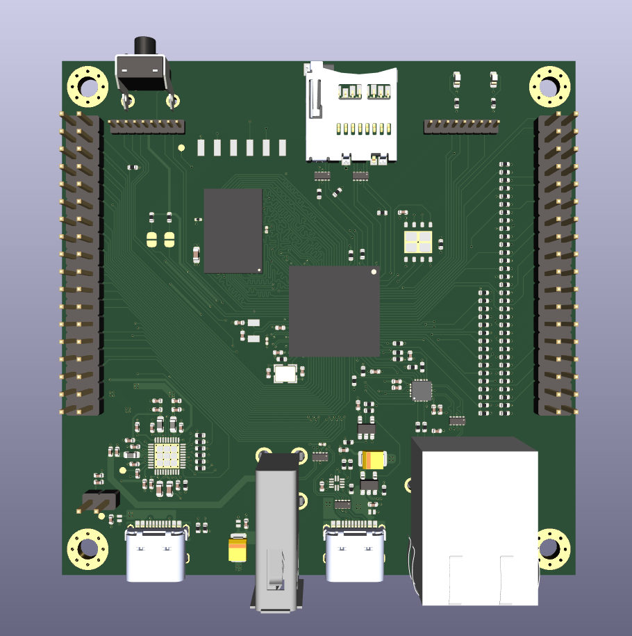
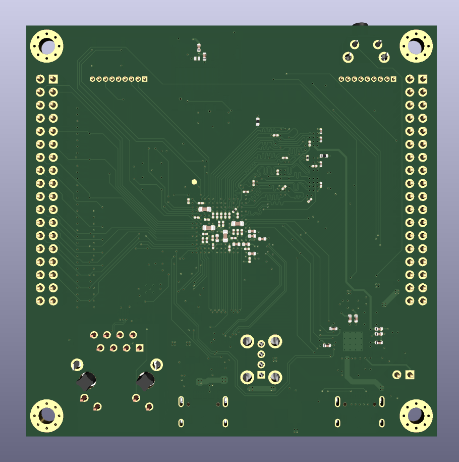

# qsbc-zero

## About

Specs:

- i.MX6ULL ARM Cortex-A7
- 512MB DDR3L
- 4MB QSPI Flash
- MicroSD card slot
- USB Type-C DRP and USB Type-A port
- 10/100M Ethernet
- Dual 36 pin GPIO headers
- PF1510 PMIC
- USB Type-C Power in

## TODO

### Rev 2
- Change QSPI flash PN to W25Q32JVZPIQ
- Optimize BOM
- R2 and R5 PN is wrong
- Some Ratings do not match PNs
- Move USB Type-A connector, so lip does not hit board
- Use interrupt for ETH PHY
- Fix LED order on PCB
- Swap USB-A and USB-C Locations

### Linux
- Port PF1510 driver
